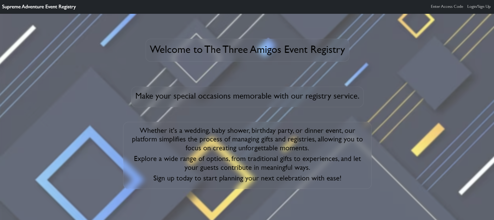

<!DOCTYPE html>
<html lang="en">
<head>
<meta charset="UTF-8">
<meta name="viewport" content="width=device-width, initial-scale=1.0">
<title>Three Amigos Event Registry</title>
<style>
  body {
    font-family: Arial, sans-serif;
    margin: 0;
    padding: 0;
  }
  nav {
    background-color: #333;
    overflow: hidden;
    position: fixed; /* Set navbar to a fixed position */
    width: 100%; /* Make navbar span the full width */
  }
  nav a {
    float: left;
    display: block;
    color: white;
    text-align: center;
    padding: 14px 20px;
    text-decoration: none;
  }
  nav a:hover {
    background-color: #ddd;
    color: black;
  }
  .content {
    padding-top: 50px; /* Add padding-top to content to prevent it from being hidden by the fixed navbar */
    padding-left: 20px; /* Adjust padding to align with the navbar */
  }
   img {
    max-width: 50%; /* Ensure the image doesn't exceed its container width */
    height: auto; /* Maintain aspect ratio */
    display: block; /* Remove default inline display */
    margin: 0 auto; /* Center horizontally */
    margin-bottom: 20px; /* Add some bottom margin for spacing */
  }
  h1, h2, h3, h4 {
    color: cyan;
    border-bottom: 1px solid cyan;
    width: 50%;
  }
  h1 {
    width: 100%;
    text-align: center;
  }
  h2, h3, h4 {
    padding-top: 20px;
  }
  h3, h4 {
    width: 25%;
  }
  details {
    margin-bottom: 20px;
  }
  summary {
    color: lime;
    font-size: 12px;
  }
  #introduction,
  #user-story,
  #features,
  #future-development,
  #usage,
  #contributors, 
  #license, 
  #deployed-application {
    padding-top: 20px;
  }
</style>

</head>
<body>
<nav>
  <a href="#introduction">Introduction</a>
  <a href="#user-story">User Story</a>
  <a href="#features">Features</a>
  <a href="#future-development">Future Development</a>
  <a href="#installation">Installation</a>
  <a href="#usage">Usage</a>
  <a href="#contributors">Contributors</a>
  <a href="#license">License</a>
  <a href="#deployed-application">Deployed Application</a>
</nav>
<div class="content">
  <h1>Three Amigos Event Registry</h1>
   
  <section id="introduction">
    <h2>Introduction</h2>
    <p>The Three Amigos Event Registry serves as a comprehensive solution for managing events such as weddings, birthdays, or baby showers. When you're organizing a joyous celebration, this registry offers the tools you need to keep track of guests, gifts, and other essential details.</p>
  </section>

  <section id="user-story">
    <h2>User Story and Acceptance Criteria</h2>
    As a user interested in organizing an event, I want to utilize The Three Amigos Event Registry platform to streamline my planning process.


<h4 style="color: lime; border-bottom: 1px solid lime; width: 25%">Scenario: Signing Up or Logging In</h4>


**Given:** I am a new user or an existing user of The Three Amigos Event Registry platform.  

**When:** I access The Three Amigos Event Registry website.  

**Then:**

- If I am a new user:  

  - I want to sign up for an account by providing a unique username, user details, and password.  

  - After signing up, I expect to be directed to the homepage/dashboard.   

- If I am an existing user:  

  - I want to log in using my existing credentials.  

  - After logging in successfully, I expect to be directed to the homepage/dashboard.  


<h4 style="color: lime; border-bottom: 1px solid lime; width: 25%">Scenario: Creating an Event List and Adding Items </h4> 


**Given:** I am logged in and on the homepage/dashboard of The Three Amigos Event Registry platform.  

**When:** I decide to organize a new event.  

**Then:**  

- I want to create a new event list by making an access code and specifying the event's type, name and date.  

- After creating the event list, I want the option to add items to it, such as gifts or tasks related to the event.  

  

<h4 style="color: lime; border-bottom: 1px solid lime; width: 25%">Scenario: Viewing Event Lists on the Homepage</h4>


**Given:** I am logged in and on the homepage/dashboard of The Three Amigos Event Registry platform.  

**When:** I want to see an overview of all my event lists.  

**Then:**

- I expect to see each event list displayed as a card on the homepage/dashboard.

- Each card should contain essential information about the event, such as its name, date, and link to the list.

- I can click on a card to view and manage the details of the corresponding event list.  
<h3 style="color: cyan; border-bottom: 1px solid cyan; width: 50%">Future Development Scenarios</h3>

<details>
<summary style="color: lime;font-size:12px;">Expand/Collapse</summary>

<h4 style="color: lime; border-bottom: 1px solid lime; width: 25%">Scenario: Managing Guests and RSVPs</h4>


**Given:** I have created an event and need to manage attendees.  

**When:** I want to handle guest invitations and RSVPs efficiently.  

**Then:**

- As a user, I want to:

  - Easily add guests to the event list and track their RSVP status.

  - Receive notifications for RSVPs and manage guest details seamlessly.

  - Have a clear overview of attendees and their preferences for smooth event planning.


<h4 style="color: lime; border-bottom: 1px solid lime; width: 25%">Scenario: Task Management</h4>


**Given:** I am organizing an event and need to manage tasks.  

**When:** I want to ensure tasks are completed on time.  

**Then:**

- As a user, I want to:

  - Create and assign tasks for event preparation and execution.

  - Track task progress, mark them as complete, and receive reminders for pending tasks.

  - Collaborate with team members efficiently by sharing tasks and updates.


<h4 style="color: lime; border-bottom: 1px solid lime; width: 25%">Scenario: Budget Tracking</h4>


**Given:** I have a budget for my event and want to stay within it.  

**When:** I need to monitor expenses.  

**Then:**

- As a user, I want to:

  - Set a budget for the event and track expenses against it.

  - Categorize expenses and receive alerts for budget overruns.

  - Have a clear overview of spending to make informed decisions and adjustments.


<h4 style="color: lime; border-bottom: 1px solid lime; width: 25%">Scenario: Customizable Invitations</h4>


**Given:** I want to send personalized invitations for my event.  

**When:** I need to design and distribute invitations.  

**Then:**

- As a user, I want to:

  - Choose from a variety of invitation templates and customize them with event details.

  - Preview invitations before sending and track their delivery status.

  - Add personal touches to invitations to match the event's theme and style.


<h4 style="color: lime; border-bottom: 1px solid lime; width: 25%">Scenario: Interactive Event Dashboard</h4>


**Given:** I am managing multiple events and need an overview.  

**When:** I want to access event details and monitor progress.  

**Then:**

- As a user, I want to:

  - Access a centralized dashboard displaying all events and their key details.

  - Monitor RSVPs, task completion, and budget status for each event.

  - Customize the dashboard layout to prioritize important information.


<h4 style="color: lime; border-bottom: 1px solid lime; width: 25%">Scenario: Collaborative Planning</h4>


**Given:** I am coordinating with others to plan an event.  

**When:** I need to share responsibilities and updates.  

**Then:**

- As a user, I want to:

  - Invite collaborators to join event planning efforts and assign tasks.

  - Communicate with team members within the platform and track their contributions.

  - Ensure transparency and accountability in the planning process.

</details>
  </section>
  
  <section id="features">
    <h2>Features</h2>
    <ul>
      <li><strong>Event Creation</strong>: Easily create new events by specifying details such as event type, date, time, and location.</li>
      <li><strong>Gift Registry</strong>: Create and manage a list of desired gifts, making it easy for guests to choose and purchase items.</li>
    </ul>
  </section>
  
  <section id="future-development">
    <h2>Future Development Features</h2>
    <details>
      <summary>Expand/Collapse</summary>
      <ul>
        <li><strong>Guest Management</strong>: Seamlessly manage your guest list by adding, editing, or removing guests. Keep track of RSVPs and meal preferences for each guest.</li>
        <li><strong>Task Management</strong>: Stay organized by creating tasks and assigning them to specific events or guests. Track task completion status to ensure everything runs smoothly.</li>
        <li><strong>Budget Tracking</strong>Set and monitor your event budget. Record expenses and track spending to stay within your budget constraints.</li>
        <li><strong>Customizable Invitations</strong>Design and send personalized invitations to your guests. Choose from a variety of templates and customize them with event details and themes.</li>
        <li><strong>Interactive Event Dashboard</strong>Access a centralized dashboard to view all your events at a glance. Monitor RSVPs, tasks, and budget status from one convenient location.</li>
        <li><strong>Collaborative Planning</strong>Invite collaborators such as co-hosts or event planners to work together on event organization. Share access to event details and tasks for seamless collaboration.</li>
      </ul>
    </details>
  </section>
  
  <section id="installation">
    <h2>Installation</h2>
    To set up The Three Amigos Event Registry on your local machine, follow these steps:


1. Clone the repository to your local machine:

   ```bash

   git clone https://github.com/C-Johnson83/supreme-adventure.git

   ```

2. Navigate to the project directory:

   ```bash

   cd supreme-adventure

   ```

3. Install dependencies using npm:

   ```bash

   npm install

4. Create a .env file in the server level (This file can contain sensitive information and is not typically included in a repository. This is why you must create your own)

    ```bash

    cd server

    touch .env  

5. Enter the text editor for the .env file 

    ```bash

     nano .env

6. Include the SECRET

    ```bash

      SECRET='magicPassword'

7. Exit the editor 

    ```bash

    Ctrl + x   

8. Confirm the changes with 'Y' then press enter
9. Return to the main level

    ```bash

    cd ..  

  </section>
  
  <section id="usage">
    <h2>Usage</h2>
    After installing the Event Registry, you can start using it for your event planning needs:


1. **Start the Application**:

   ```bash

   npm run dev

   ```

2. **Access the Application**:

   Open your web browser and navigate to `http://localhost:3000` to access the Event Registry.


3. **Create an Event**:

   Begin by creating a new event and providing essential details such as the event type, date, time, and location.    


### ----------------Not quite Yet----------------

4. **Set Up Gift Registry**:  

   Optionally, set up a gift registry and add desired items. Guests can then view the registry and mark gifts as purchased.

5. **Manage Guests**:

   Add guests to your event, including their names, email addresses, and any additional notes. You can also track RSVPs and meal preferences if applicable.

  </section>
  
  <section id="contributors">
    <h2>Contributors</h2>
    Contributing to this project are 3 very skilled software developers:  

    -   C-Johnson83 aka Chrispy  

    -   dbrainz   

    - Hanszilzer
  </section>
  
  <section id="license">
    <h2>License</h2>
    This project is licensed under the MIT License. For more information, see the [LICENSE](LICENSE) file.


[](https://opensource.org/licenses/MIT)


Thank you for choosing the Three Amigos Event Registry for your event planning needs! If you have any questions or need assistance, please don't hesitate to reach out to us. Happy planning! tada emoji
  </section>
  
<section id="deployed-application">
    <h2>Deployed Application</h2>
    <a href="https://registry-km6c.onrender.com/" target="_blank">https://registry-km6c.onrender.com/</a>
</section>

</div>
</body>
</html>


